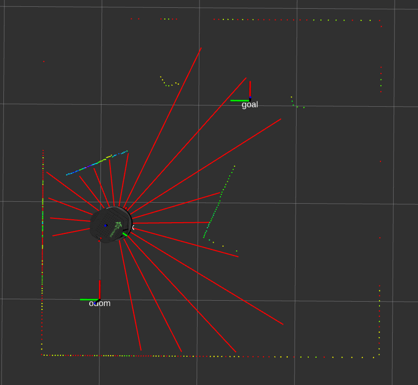

# Map-less Navigation with Obstacle avoidance

## Abstract

This project uses a `DDQN` (*Double Deep Q-Learning Network*) for a map-less navigation of a Turtlebot to a desired target position. Furthermore, the robot should avoid obstacles along that path. 

The project is structured in the following subfolders:
* [ros](ros) contains the full ros implementation on the Turtlebot
* [snippets](snippets) contains the code for the different approaches during the project
* [simulator](simulator) contains a 2D simulator to train the model based on Box2D and SFML

## State space

The state space consits of
* distance to the target position
* angle difference of heading with respect to the target
* 18 rays of a laser range finder

That results in a 20-dimensional input state for the DDQN.

## Actions
The agent can perform the following actions
* `forward` (0.3 m/s linear velocity in x)
* `turn left` (0.06 m/s linear velocity in x, -0.6 rad/s angular velocity in z)
* `turn right` (0.06 m/s linear velocity in x, 0.6 rad/s angular velocity in z)

## Rewards

* crash with obstacle   *r_crash = -150*
* reach target   *r_goal = 50*
* distance based reward   *r_dist = 1.5 (current_pos - goal_pos)*
* reward for distance to obstacles   *r_obst = 1.5 tanh( 4( min{lidar_rays} - 0.8) )*

