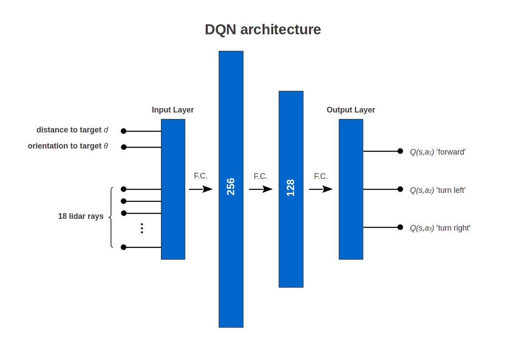

# Map-less Navigation with Obstacle avoidance

This directory consists of

## Delpendencies

* [matio](https://github.com/tbeu/matio)
* [MiniDNN](https://github.com/yixuan/MiniDNN)
* [turtlebot packages](http://wiki.ros.org/turtlebot) (ros)
* [SFML](https://www.sfml-dev.org/)
* [Box2D](http://box2d.org/)

# Contributions

## Box2D-Simulation
In order to increase the Simulation speed we programmed a fast 2D robot
simulator in c++. It is based on the physics lirbary [Box2D](http://box2d.org/)
and uses [SFML](https://www.sfml-dev.org/) to produce graphical output.
The simulator is able to handle multible agents and dynamic obstacles in a
rectangular environment.

With a simulation step size of 0.02s it achives **1000 times real time speed** which
is a huge speed up compared to Gazebo.

## Verification in Gazebo Environment
Since our Box2D-Simulation only uses a simplified physics model, we verified
our learned DQN in a Gazebo environment. Both Simulators show very similar
behaviour, so the Box2D-Simulator is totaly sufficient for the Turtlebot dynamics.

## Q-Learning
In our first approch we used tabular Q-Learning. Although we reduced the possible number of state action combinations to 60.000 the agent was not able to learn the mapless navigation with obstacle avoidance problem. In order to get a sufficient small input space we used a five-dimensional input space consisting of 3 laser rays
(-45°, 0, 45°), the distance and orientation to the target.

## Double DQN
Our final approch uses a Double Deep Q-learning algorithm which successfully
solves Map-less Navigation with Obstacle avoidance task.

The input of the network is 20 dimensional vector that contains 18 laser rays,
the distance and orientation to the target. Two hidden layers with 256 and 128
relu-neurons estimate the Q-Values for each of the three possible actions.

The feedforward neuronal network is implemented with [MiniDNN](https://github.com/yixuan/MiniDNN) which is an easy to use header-only
c++ lirbary based on Eigen. The training runs on cpu and can use multible cores
if [OpenMP](https://www.openmp.org/) is enabled. Learning progess is continously
saved in a Mat file by the lirbary [matio](https://github.com/tbeu/matio).

### Hyperparameters
* minibatch size: 128
* replay memory size: 3000000
* target network update frequency: 20000 steps
* discount factor: 0.95
* action update frequency: 5Hz
* optimizer: rmsprop
* learning rate: 0.0004
* loss function: huber loss
* inital exploration: 1
* final exploration: 0.1
* exploration discount: 0.99997

### Learning

Learning takes about 50000 episodes and requires approximately 3 hours.
